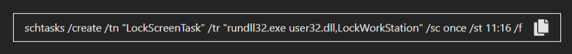
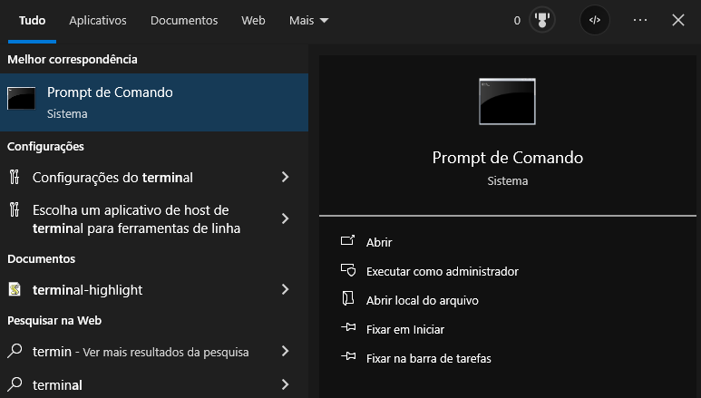
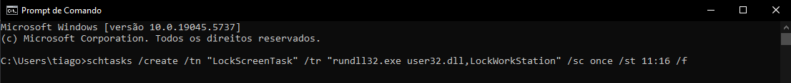
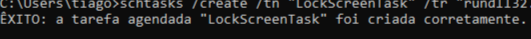

## Para que serve o projeto ?

Este projeto gera um comando que, quando executado no Prompt de Comando do Windows, suspende a sessão após o período de tempo selecionado. Após a suspensão, será necessário informar a senha de acesso do computador.

A ideia surgiu a partir de um pedido de um amigo que queria limitar o tempo que o irmão dele passa jogando no computador.

## Como utilizar

### Selecione em quanto tempo deseja suspender a tela

### Clique no botão para gerar o código

### Copie o código

### Abra o terminal do seu computador

### Cole o codigo e pressione a tecla "Enter"

### Se tudo ocorrer corretamente, uma mensagem de êxito aparecerá no terminal:

